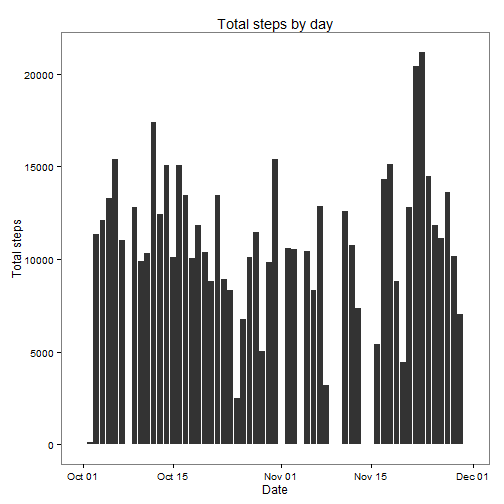
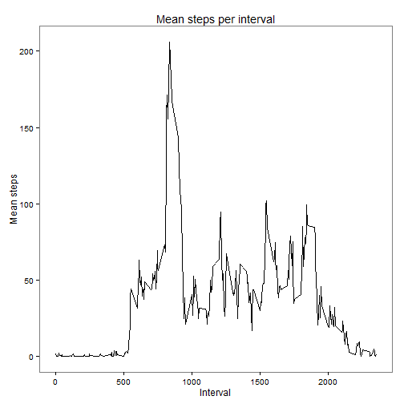
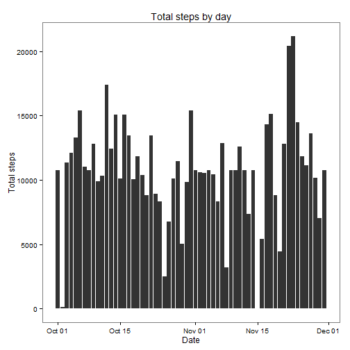
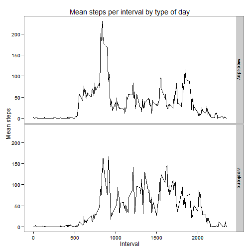

# Reproducible Research: Peer Assessment 1  


## Loading and preprocessing the data

```r
act<-read.csv("activity.csv", header=TRUE)
act$dateF<-as.Date(act$date)
library(plyr)
library(ggplot2)
```


## What is mean total number of steps taken per day?  
Calculate the total number of steps taken per day.

```r
sumSteps <- ddply(act, c("dateF"), summarise, sum = sum(steps, na.rm=TRUE))
```

Generate histogram.

```r
ggplot(data=sumSteps, aes(x=dateF, y=sum)) + 
  geom_bar(stat="identity") +
  xlab ("Date") +
  ylab("Total steps") +
  ggtitle("Total steps by day") +
  theme_bw() +
  theme(panel.grid.major = element_blank(), panel.grid.minor = element_blank())
```

 


```r
meanTotSteps<-mean(sumSteps$sum)
medianTotSteps<-median(sumSteps$sum)
```
The mean total number of steps taken per day is 9354.2295.  
The median total number of steps taken per day is 10395.


## What is the average daily activity pattern?  
Calculate average number of steps taken per interval.

```r
avgSteps <- ddply(act, c("interval"), summarise, mean = mean(steps, na.rm=TRUE))
```

Generate time series plot.

```r
ggplot(data=avgSteps, aes(x=interval, y=mean)) +
  geom_line() +
  xlab("Interval") +
  ylab("Mean steps") +
  ggtitle("Mean steps per interval") +
  theme_bw() +
  theme(panel.grid.major = element_blank(), panel.grid.minor = element_blank())
```

 

```r
maxAvg<-avgSteps[which(avgSteps$mean==max(avgSteps$mean)),]$interval
```
The maximum average number of steps are taken during the 835 interval.


## Imputing missing values  

```r
nmiss<-nrow(act[!complete.cases(act),])
```
There are 2304 total missing values in this dataset. 

Fill in missing values using average number of steps taken for that interval.

```r
imputed<-merge(act, avgSteps, "interval")
imputed$stepsI<-ifelse(is.na(imputed$steps), imputed$mean, imputed$steps)
```

Generate histogram using imputed data.

```r
sumStepsI <- ddply(imputed, c("dateF"), summarise, sum = sum(stepsI, na.rm=TRUE))
ggplot(data=sumStepsI, aes(x=dateF, y=sum)) + 
  geom_bar(stat="identity") +
  xlab ("Date") +
  ylab("Total steps") +
  ggtitle("Total steps by day") +
  theme_bw() +
  theme(panel.grid.major = element_blank(), panel.grid.minor = element_blank())
```

 


```r
meanTotStepsI<-mean(sumStepsI$sum)
medianTotStepsI<-median(sumStepsI$sum)
```
The mean total number of steps taken per day is 1.0766 &times; 10<sup>4</sup>.  
The median total number of steps taken per day is 1.0766 &times; 10<sup>4</sup>.

These values are greater than the mean and median total number of steps taken per day calculated in the first part of the assignment.  In general, this method of imputation results in greater total steps taken per day. 


## Are there differences in activity patterns between weekdays and weekends?  
Create new variable indicating weekday or weekend day.

```r
imputed$wkday <- weekdays(imputed$dateF)
imputed$typeday <- as.factor(ifelse(imputed$wkday=="Saturday" | imputed$wkday=="Sunday", "weekend", "weekday"))
```

Generate panel plot.

```r
avgStepsDay <- ddply(imputed, c("interval", "typeday"), summarise, mean = mean(stepsI, na.rm=TRUE))
ggplot(data=avgStepsDay, aes(x=interval, y=mean)) +
  geom_line() +
  xlab("Interval") +
  ylab("Mean steps") +
  ggtitle("Mean steps per interval by type of day") +
  theme_bw() +
  theme(panel.grid.major = element_blank(), panel.grid.minor = element_blank()) +
  facet_grid(typeday ~ .) 
```

 
